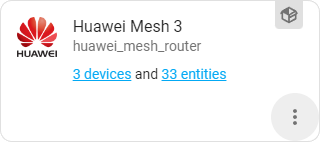
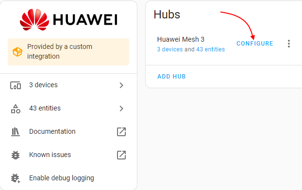
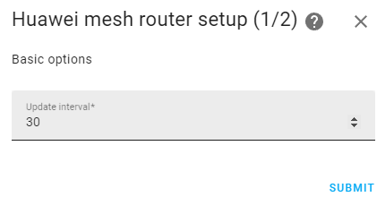
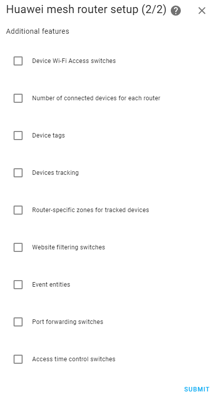

# Control Huawei mesh routers from Home Assistant

Home Assistant custom component for control Huawei mesh routers over LAN.

## Key features

- obtaining information about all routers and connected devices in the entire mesh network:
  - connected devices tracking and tagging
  - device connection parameters (frequency, signal strength, guest and hilink devices, upload/download rates)
  - name of the specific router to which the device is connected
  - number of connected devices (total and for each individual router)
- Wi-Fi access management:
  - enable/disable/configure the guest Wi-Fi network
  - enable or disable Wi-Fi access control
  - add/remove devices from blacklist/whitelist
  - Wi-Fi access switch per client device
- enabling and disabling access to specific sites
- hardware and firmware version of the primary router
- Internet connection details (IP address, status, upload/download rates)
- uptime of each router
- control of the NFC (OneHop Connect) on each router separately
- control of the Fast Roaming function (802.11r)
- control of the Target Wake Time (reduce power consumption of Wi-Fi 6 devices in sleep mode)
- port mapping switches
- Internet access time control switches
- reboot buttons
- events for connecting, disconnecting, or moving devices over a mesh network
- automatic detection of available functions

## Confirmed supported models

|                                        Name                                        |  Model |                    Notes                    |
|------------------------------------------------------------------------------------|--------|---------------------------------------------|
| [Huawei WiFi AX3 Dual-core](https://consumer.huawei.com/en/routers/ax3-dual-core/) | WS7100 | No NFC switches (unsupported by router)     |
| [Huawei WiFi AX3 Quad-core](https://consumer.huawei.com/en/routers/ax3-quad-core/) | WS7200 |                                             |
| [Huawei WiFi AX3 Pro](https://consumer.huawei.com/en/routers/ax3-pro/)             | WS7206 |                                             |
| [Huawei WiFi Mesh](https://consumer.huawei.com/en/routers/wifi-mesh/)              | AC2200 |                                             |
| [Huawei WiFi Mesh 3](https://consumer.huawei.com/en/routers/wifi-mesh3/)           | WS8100 | My router model. All features are available |
| [Huawei WiFi Mesh 7](https://consumer.huawei.com/en/routers/wifi-mesh7/)           | WS8800 |                                             |
| [Honor Router 3](https://www.hihonor.com/global/routers/honor-router-3/)           |  XD20  |                                             |

Other Huawei routers based on HarmonyOS (except Chinese domestic market) most likely will work.

## Not supported models

|                                        Name                                        |  Model |                     Notes                     |
|------------------------------------------------------------------------------------|--------|-----------------------------------------------|
| [Huawei Q2S](https://consumer.huawei.com/cn/support/routers/ws5280/)               | WS5281 | The router blocks requests from the component |
| [Huawei Q2 Pro](https://consumer.huawei.com/cn/support/routers/q2-pro-2pack/)      | WS5280 | The router blocks requests from the component |
| [Huawei Q6](https://consumer.huawei.com/cn/support/routers/q6/)                    | WS7290 | The router blocks requests from the component |

As far as I can understand, problems arise with routers designed for the domestic market of China. Unfortunately, I do not have such devices available so that I can try to find out the reasons for this behavior.

## Installation

### Manual

Copy `huawei_mesh_router` folder from [latest release](https://github.com/vmakeev/huawei_mesh_router/releases/latest) to `custom_components` folder in your Home Assistant config folder and restart Home Assistant. The final path to folder should look like this: `<home-assistant-config-folder>/custom_components/huawei_mesh_router`.

### HACS

`HACS` **->** type `huawei mesh router` **->** click on it **->** press `DOWNLOAD` button and follow the instructions.

Or simply click the button below:

## Configuration

Configuration > [Integrations](https://my.home-assistant.io/redirect/integrations/) > Add Integration > [Huawei Mesh Router](https://my.home-assistant.io/redirect/config_flow_start/?domain=huawei_mesh_router)

By default, Huawei mesh routers use the username `admin`, although it is not displayed in the web interface and mobile applications.

## Troubleshooting

If the component does not work, or does not work correctly, try to go to the [troubleshooting section](docs/troubleshooting/troubleshooting.md)

### Advanced options

You can perform advanced configuration of the component after adding it. 
To do this, click on the intergation, and in the tab that opens, click `CONFIGURE`

Advanced settings include:
|                                                       Name                                                       |  Default   |
|------------------------------------------------------------------------------------------------------------------|------------|
| Update interval                                                                                                  | 30 seconds |
| Enabling or disabling [Device Wi-Fi Access switches](docs/controls.md#device-wi-fi-access)                       |  Disabled  |
| Enabling or disabling [Number of connected devices for each router](docs/sensors.md#number-of-connected-devices) |  Disabled  |
| Enabling or disabling [Device tags](docs/device-tags.md#device-tags)                                             |  Disabled  |
| Enabling or disabling [Devices tracking](docs/device-tracking.md#devices-tracking)                               |  Disabled  |
| Enabling or disabling [Router-specific zones](docs/device-tracking.md#router-specific-zones)                     |  Disabled  |
| Enabling or disabling [Website filtering switches](docs/controls.md#website-filtering)                           |  Disabled  |
| Enabling or disabling [Event entities](docs/events.md#event-entities)                                            |  Disabled  |
| Enabling or disabling [Port mapping switches](docs/controls.md#port-mapping)                                     |  Disabled  |

*Note: click `SUBMIT` to go to the next page*

*Note: click `SUBMIT` to save the changes and complete the setup*

## Devices tracking

The component allows you to track all devices connected to your mesh network. Each router can provide information about the zone to which all devices connected to it will be assigned (if enabled in the [advanced options](#advanced-options)). [Read more](docs/device-tracking.md)

You can attach one or more tags to each client device in order to be able to use in automation the number of devices marked with a tag, connected to a specific router, or to the entire mesh network. [Read more](docs/device-tags.md#device-tags)

## Sensors

* Number of connected devices ([read more](docs/sensors.md#number-of-connected-devices))
* Uptime ([read more](docs/sensors.md#uptime))
* Internet connection ([read more](docs/sensors.md#internet-connection))

## Controls

### Buttons

* Reboot router ([read more](docs/controls.md#reboot))

### Switches

* NFC ([read more](docs/controls.md#nfc-switch))
* Wi-Fi 802.11r ([read more](docs/controls.md#wi-fi-80211r-switch))
* Wi-Fi TWT ([read more](docs/controls.md#wi-fi-6-twt-switch))
* Wi-Fi Access Control ([read more](docs/controls.md#wi-fi-access-control))
* Device Wi-Fi Access ([read more](docs/controls.md#device-wi-fi-access))
* Website filtering ([read more](docs/controls.md#website-filtering))
* Guest network ([read more](docs/controls.md#guest-network))
* Port mapping ([read more](docs/controls.md#port-mapping))
* Internet access time ([read more](docs/controls.md#internet-access-time))

### Selects
* Wi-Fi access control mode ([read more](docs/controls.md#wi-fi-access-control-mode))
* Router-specific zone ([read more](docs/controls.md#router-specific-zone))

## Services

* Add device to the whitelist ([read more](docs/services.md#add-device-to-the-whitelist))
* Add device to the blacklist ([read more](docs/services.md#add-device-to-the-blacklist))
* Remove device from the whitelist ([read more](docs/services.md#remove-device-from-the-whitelist))
* Remove device from the blacklist ([read more](docs/services.md#remove-device-from-the-blacklist))
* Configure the parameters of the guest Wi-Fi network ([read more](docs/services.md#set-up-a-guest-network))

## Events

### Regular events

* The dependent router has connected to the mesh network ([read more](docs/events.md#the-dependent-router-has-connected-to-the-mesh-network))
* The dependent router disconnected from the mesh network ([read more](docs/events.md#the-dependent-router-disconnected-from-the-mesh-network))
* The device has connected to the mesh network ([read more](docs/events.md#the-device-has-connected-to-the-mesh-network))
* The device disconnected from the mesh network ([read more](docs/events.md#the-device-disconnected-from-the-mesh-network))
* The device has changed the router within the mesh network ([read more](docs/events.md#the-device-has-changed-the-router-within-the-mesh-network))

### Events as entities

* Router events ([read more](docs/events.md#routers))
* Device events ([read more](docs/events.md#devices))
