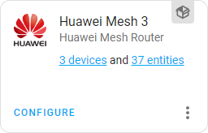

# Control Huawei mesh routers from Home Assistant

Home Assistant custom component for control Huawei mesh routers over LAN.

## Key features

- obtaining information about all routers and connected devices in the entire mesh network:
  - connected devices tracking and tagging
  - device connection parameters (frequency, signal strength, guest and hilink devices)
  - name of the specific router to which the device is connected
  - number of connected devices (total and for each individual router)
- Wi-Fi access management:
  - enable or disable Wi-Fi access control
  - add/remove devices from blacklist/whitelist
  - Wi-Fi access switch per client device
- hardware and firmware version of the primary router
- internet connection details
- uptime of each router
- control of the NFC (OneHop Connect) on each router separately
- control of the Fast Roaming function (802.11r)
- control of the Target Wake Time (reduce power consumption of Wi-Fi 6 devices in sleep mode)
- reboot buttons
- automatic detection of available functions

## Supported models

|                                        Name                                        |  Model | Confirmed |                    Notes                    |
|------------------------------------------------------------------------------------|--------|-----------|---------------------------------------------|
| [Huawei WiFi AX3 Dual-core](https://consumer.huawei.com/en/routers/ax3-dual-core/) | WS7100 |    Yes    | No NFC switches (unsupported by router)     |
| [Huawei WiFi AX3 Quad-core](https://consumer.huawei.com/en/routers/ax3-quad-core/) | WS7200 |    Yes    |                                             |
| [Huawei WiFi AX3 Pro](https://consumer.huawei.com/en/routers/ax3-pro/)             | WS7206 |    No     |                                             |
| [Huawei WiFi Mesh 3](https://consumer.huawei.com/en/routers/wifi-mesh3/)           | WS8100 |    Yes    | My router model. All features are available |
| [Huawei WiFi Mesh 7](https://consumer.huawei.com/en/routers/wifi-mesh7/)           | WS8800 |    Yes    |                                             |
| Other routers with HarmonyOS                                                       | ------ |    No     | Will most likely work                       |             

## Installation

### Manual

Copy `huawei_mesh_router` folder from [latest release](https://github.com/vmakeev/huawei_mesh_router/releases/latest) to `custom_components` folder in your Home Assistant config folder and restart Home Assistant. The final path to folder should look like this: `<home-assistant-config-folder>/custom_components/huawei_mesh_router`.

### HACS

`HACS` **->** press `EXPLORE & DOWNLOAD REPOSITORIES` button **->** type `huawei mesh router` **->** press `DOWNLOAD` button and follow the instructions.

Or simply click the button below:

## Configuration

Configuration > [Integrations](https://my.home-assistant.io/redirect/integrations/) > Add Integration > [Huawei Mesh Router](https://my.home-assistant.io/redirect/config_flow_start/?domain=huawei_mesh_router)

By default, Huawei mesh routers use the username `admin`, although it is not displayed in the web interface and mobile applications.

### Advanced options

You can perform advanced component configuration by clicking the `CONFIGURE` button after adding it. 

Advanced settings include:
|                                                       Name                                                       |  Default   |
|------------------------------------------------------------------------------------------------------------------|------------|
| Update interval                                                                                                  | 30 seconds |
| Enabling or disabling [Device Wi-Fi Access switches](docs/controls.md#device-wi-fi-access)                       |  Disabled  |
| Enabling or disabling [Number of connected devices for each router](docs/sensors.md#number-of-connected-devices) |  Enabled   |
| Enabling or disabling [Device tags](docs/device-tags.md#device-tags)                                             |  Disabled  |
| Enabling or disabling [Devices tracking](docs/device-tracking.md#devices-tracking)                               |  Enabled   |
| Enabling or disabling [Router-specific zones](docs/device-tracking.md#router-specific-zones)                     |  Disabled   |

## Devices tracking

The component allows you to track all devices connected to your mesh network. Each router can provide information about the zone to which all devices connected to it will be assigned (if enabled in the [advanced options](#advanced-options)). [Read more](docs/device-tracking.md)

You can attach one or more tags to each client device in order to be able to use in automation the number of devices marked with a tag, connected to a specific router, or to the entire mesh network. [Read more](docs/device-tags.md#device-tags)

## Sensors

* Number of connected devices ([read more](docs/sensors.md#number-of-connected-devices))
* Uptime ([read more](docs/sensors.md#uptime))
* Internet connection ([read more](docs/sensors.md#internet-connection))

## Controls

### Buttons

* Reboot router ([read more](docs/controls.md#reboot))

### Switches

* NFC switch ([read more](docs/controls.md#nfc-switch))
* Wi-Fi 802.11r switch ([read more](docs/controls.md#wi-fi-80211r-switch))
* Wi-Fi TWT switch ([read more](docs/controls.md#wi-fi-6-twt-switch))
* Wi-Fi Access Control ([read more](docs/controls.md#wi-fi-access-control))
* Reboot router ([read more](docs/controls.md#reboot))
* Device Wi-Fi Access ([read more](docs/controls.md#device-wi-fi-access))

### Selects
* Wi-Fi access control mode ([read more](docs/controls.md#wi-fi-access-control-mode))
* Router-specific zone ([read more](docs/controls.md#router-specific-zone))

## Services

* Add device to the whitelist ([read more](docs/services.md#add-device-to-the-whitelist))
* Add device to the blacklist ([read more](docs/services.md#add-device-to-the-blacklist))
* Remove device from the whitelist ([read more](docs/services.md#remove-device-from-the-whitelist))
* Remove device from the blacklist ([read more](docs/services.md#remove-device-from-the-blacklist))
