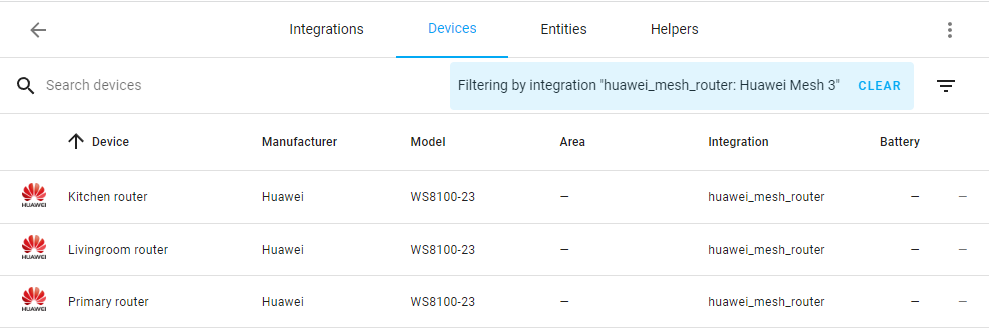
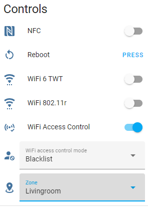

# Controls

The component creates a separate device for each router connected to the mesh network. 

Each device has its own set of controls. 

The primary router has more controls than the additional ones.

**Primary router controls:**

**Additional router controls:**

## Buttons

### Reboot

Allows you to reboot the selected router.

There is one button that is always present:
* `button.<integration_name>_reboot_primary_router`

Also, one button is created for each additional router in the mesh network:
* `button.<integration_name>_reboot_<router_name>`

_Note: Buttons for additional routers are located in their own devices._

## Switches

### NFC switch

Allows you to manage the [OneHop connect](https://consumer.huawei.com/ph/support/content/en-us11307411/) function on each router in the mesh network.

The switches will not be added to Home Assistant if the router does not support NFC.

Primary router have the following switch:
* `switch.<integration_name>_nfc_primary_router`

Also, one switch is created for each supported additional router in the mesh network:
* `switch.<integration_name>_nfc_<router_name>`

_Note: Switches for additional routers are located in their own devices._

### Wi-Fi 802.11r switch

Allows you to manage the fast roaming feature ([Wi-Fi 802.11r](https://support.huawei.com/enterprise/en/doc/EDOC1000178191/f0c65b61/80211r-fast-roaming)).

The switch will not be added to Home Assistant if the router does not support Wi-Fi 802.11r.

### Wi-Fi 6 TWT switch

Allows you to manage the Wi-Fi Target Wake Time ([TWT](https://forum.huawei.com/enterprise/en/what-is-twt-in-wifi-devices/thread/623758-869)) feature.

The switch will not be added to Home Assistant if the router does not support Wi-Fi TWT.

### Wi-Fi Access Control

Allows you to manage the Wi-Fi Access Control feature.

The switch will not be added to Home Assistant if the Primary router does not support Wi-Fi Access Control.

_Note: this switch is not enabled by default. If you need to use this feature, please enable it manually. Don't use this feature if you don't know what you are doing._

###  Device Wi-Fi Access

Allows you to enable or disable access to the Wi-Fi network for individual client device:

* turn on: the device is added to the whitelist and removed from the blacklist
* turn off: the device is added to the blacklist and removed from the whitelist

See [Wi-Fi Access Control mode](#wi-fi-access-control-mode) for more information about blacklist and whitelist.

One switch is created for each wireless client device in the mesh network:
* `switch.<integration_name>_device_wifi_access_<device_name>`

The switch will unavailable if [Wi-Fi Access Control](#wi-fi-access-control) is not in the `on` state.

These switches will not be added to Home Assistant if the Primary router does not support [Wi-Fi Access Control](#wi-fi-access-control).

_Note: these switches are not attached to a specific router device. Don't use this feature if you don't know what you are doing._

## Selects

### Wi-Fi Access Control mode

Allows you to set Wi-Fi access to blacklist or whitelist mode. In blacklist mode, devices in the list will not be able to access your router's Wi-Fi network. In whitelist mode, only devices in the list will be able to access your router's Wi-Fi network.

The select will not be added to Home Assistant if the Primary router does not support [Wi-Fi Access Control](#wi-fi-access-control).

_Note: this select is not enabled by default. If you need to use this feature, please enable it manually. Don't use this feature if you don't know what you are doing._