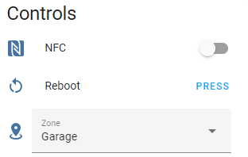
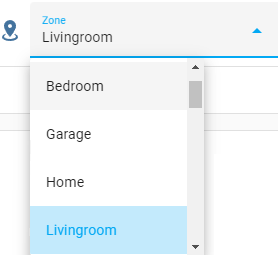

# Controls

The component creates a separate device for each router connected to the mesh network. 

Each device has its own set of controls. 

The primary router has more controls than the additional ones.

**Primary router controls:**

**Additional router controls:**

## Buttons

### Reboot

Allows you to reboot the selected router.

There is one button that is always present:
* `button.<integration_name>_reboot`

Also, one button is created for each additional router in the mesh network:
* `button.<integration_name>_reboot_<router_name>`

_Note: Buttons for additional routers are located in their own devices._

## Switches

### NFC switch

Allows you to manage the [OneHop connect](https://consumer.huawei.com/ph/support/content/en-us11307411/) function on each router in the mesh network.

The switches will not be added to Home Assistant if the router does not support NFC.

Primary router have the following switch:
* `switch.<integration_name>_nfc`

Also, one switch is created for each supported additional router in the mesh network:
* `switch.<integration_name>_nfc_<router_name>`

_Note: Switches for additional routers are located in their own devices._

### Wi-Fi 802.11r switch

Allows you to manage the fast roaming feature ([Wi-Fi 802.11r](https://support.huawei.com/enterprise/en/doc/EDOC1000178191/f0c65b61/80211r-fast-roaming)).

Primary router have the following switch:
* `switch.<integration_name>_802_11r`

The switch will not be added to Home Assistant if the router does not support Wi-Fi 802.11r.

### Wi-Fi 6 TWT switch

Allows you to manage the Wi-Fi Target Wake Time ([TWT](https://forum.huawei.com/enterprise/en/what-is-twt-in-wifi-devices/thread/623758-869)) feature.

Primary router have the following switch:
* `switch.<integration_name>_wifi_6_twt`

The switch will not be added to Home Assistant if the router does not support Wi-Fi TWT.

### Wi-Fi Access Control

Allows you to manage the Wi-Fi Access Control feature.

Primary router have the following switch:
* `switch.<integration_name>_wifi_access_control`

The switch will not be added to Home Assistant if the Primary router does not support Wi-Fi Access Control.

_Note: this switch is not enabled by default. If you need to use this feature, please enable it manually. Don't use this feature if you don't know what you are doing._

###  Device Wi-Fi Access

Allows you to enable or disable access to the Wi-Fi network for individual client device:

* turn on: the device is added to the whitelist and removed from the blacklist
* turn off: the device is added to the blacklist and removed from the whitelist

See [Wi-Fi Access Control mode](#wi-fi-access-control-mode) for more information about blacklist and whitelist.

One switch is created for each wireless client device in the mesh network:
* `switch.<integration_name>_device_wifi_access_<device_name>`

The switch will be unavailable if [Wi-Fi Access Control](#wi-fi-access-control) is not in the `on` state.

These switches will not be added to Home Assistant if the Primary router does not support [Wi-Fi Access Control](#wi-fi-access-control), or this feature is disabled in [advanced options](../README.md#advanced-options).

_Note: these switches are not attached to a specific router device. Don't use this feature if you don't know what you are doing._
_Note: this switch is not enabled by default. If you need to use this feature, please enable it manually. Don't use this feature if you don't know what you are doing._

###  Website filtering

Allows you to enable or disable access to specific websites.

One switch is created for each filter in the router:
* `switch.<integration_name>_url_filter_<website_address>`

Each switch exposes the following attributes:

|   Attribute      |                     Description                      |
|------------------|------------------------------------------------------|
| `url`            | The address of the website to which access is denied |
| `devices`        | List of devices to which the filtering applies*      |

**\*** If the filtering is applied to all devices, it will contain the value `All`. In other cases, it will contain a list of MAC addresses of devices and their displayed names

You can configure the filters themselves in the web interface of your router. 
Example address: `http://192.168.3.1/html/index.html#/more/parentcontrol`

These switches will not be added to Home Assistant if the Primary router does not support website filtering, or this feature is disabled in [advanced options](../README.md#advanced-options).

_Note: these switches are not attached to a specific router device._

_Note: if the filter is removed in the Primary router, the corresponding switch will be removed from the Home Assistant._

### Guest network

Allows you to enable or disable the guest Wi-Fi network.

Primary router have the following switch:
* `switch.<integration_name>_guest_network`

Guest network parameters (name, password, access duration, etc.) can be pre-configured in the router's web interface, or using the [service](services.md#set-up-a-guest-network)

The switch will not be added to Home Assistant if the router does not support guest Wi-Fi.

## Selects

### Wi-Fi Access Control mode

Allows you to set Wi-Fi access to blacklist or whitelist mode. In blacklist mode, devices in the list will not be able to access your router's Wi-Fi network. In whitelist mode, only devices in the list will be able to access your router's Wi-Fi network.

The select will not be added to Home Assistant if the Primary router does not support [Wi-Fi Access Control](#wi-fi-access-control).

_Note: this select is not enabled by default. If you need to use this feature, please enable it manually. Don't use this feature if you don't know what you are doing._

### Router-specific zone

Allows you to assign each router in the mesh network its own zone. 
In this case, all devices connected to this router will be considered to be located in the specified zone.

To clear the area linked to the router, select the top empty drop-down list item. In this case, the devices connected to the router will be assigned to the "Home" zone.

These selects will not be added to Home Assistant if this feature is not enabled in [advanced options](../README.md#advanced-options).

_Note: zone selectors for additional routers are located in their own devices. These settings are stored only in the file system of your Home-Assistant server: `<home assistant config folder>/.storage/huawei_mesh_<long_config_id>_router_zones`_
