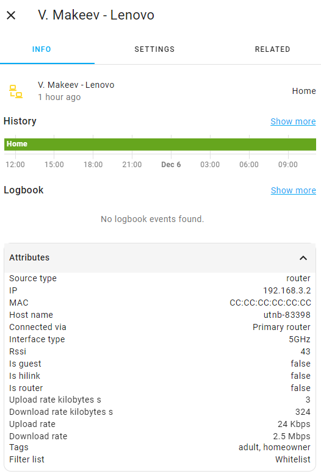

# Device tags

The component allows you to attach one or more tags to each client device in order to be able to use in automation the number of devices marked with a tag, connected to a specific router, or to the entire mesh network.

The component will attempt to load the device tag-to-MAC mapping from the file located at `<home assistant config folder>/.storage/huawei_mesh_<long_config_id>_tags`. If the file does not exist, then the component will create it with a usage example:

```
{
  "version": 1,
  "minor_version": 1,
  "key": "huawei_mesh_<long_config_id>_tags",
  "data": {
    "homeowners": [
      "place_mac_addresses_here"
    ],
    "visitors": [
      "place_mac_addresses_here"
    ]
  }
}
```

_Note: unfortunately, editing the list of tags and devices associated with them is currently available only through editing this file._

Each tag can have multiple devices associated with it. Each device can be associated with multiple tags.

Example:
```
{
  "version": 1,
  "minor_version": 1,
  "key": "huawei_mesh_<long_config_id>_tags",
  "data": {
    "my_awesome_tag": [
      "00:11:22:33:44:55",
      "A0:B1:C2:D3:E4:F5",
      "F5:E4:D3:C2:B1:A0"
    ],
    "another_tag": [
      "00:11:22:33:44:55",
      "A9:B8:C7:D6:E5:F4"
    ],
    "third_tag": [
      "99:88:77:66:55:44"
    ]
  }
}
```



**Usage example:**

|   Tag name   |          Tagged Devices           |
|--------------|-----------------------------------|
|  homeowners  | Michael's phone, Michael's laptop |
|  visitors    | Victoria's phone, Eugene's phone  |


- Michael's phone is connected to the "Garage" router
- Michael's laptop is connected to the "Living room" router
- Victoria's phone is connected to the "Living room" router
- Eugene's phone is connected to the "primary" router

In this scenario, the sensors for the number of connected devices will provide the following attributes:

|                 Sensor                        | Attributes and values |
|-----------------------------------------------|-----------------------|
| `sensor.huawei_mesh_3_clients_garage`         | `guest_clients`: 0 <br/> `hilink_clients`: 0<br/>`wireless_clients`: 1<br />`lan_clients`: 0<br />`wifi_2_4_clients`: 0<br />`wifi_5_clients`: 1<br />`tagged_homeowners_clients`: 1 _// Michael's phone_<br />`tagged_visitors_clients`: 0 <br />`untagged_clients`: 0 |
| `sensor.huawei_mesh_3_clients_living_room`    | `guest_clients`: 0 <br/> `hilink_clients`: 0<br/>`wireless_clients`: 2<br />`lan_clients`: 0<br />`wifi_2_4_clients`: 0<br />`wifi_5_clients`: 2<br />`tagged_homeowners_clients`: 1 _// Michael's laptop_<br />`tagged_visitors_clients`: 1 _// Victoria's phone_<br />`untagged_clients`: 0 |
| `sensor.huawei_mesh_3_clients_primary_router` | `guest_clients`: 0 <br/> `hilink_clients`: 2<br/>`wireless_clients`: 3<br />`lan_clients`: 0<br />`wifi_2_4_clients`: 0<br />`wifi_5_clients`: 3<br />`tagged_homeowners_clients`: 0<br />`tagged_visitors_clients`: 1 _// Eugene's phone_ <br />`untagged_clients`: 2 _// Garage and Living room routers_|