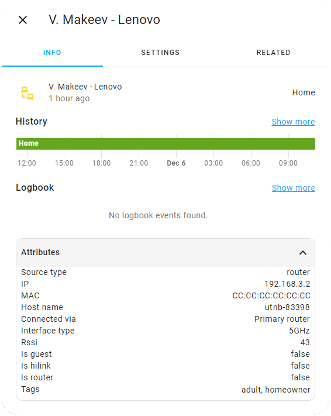

# Devices tracking

The component allows you to track all devices connected to your mesh network.

This feature is disabled by default and can be enabled in [advanced options](../README.md#advanced-options).

Each tracked device exposes the following attributes:

|          Attribute          |                                          Description                                                                     | Only when connected |
|-----------------------------|--------------------------------------------------------------------------------------------------------------------------|---------------------|
| `source_type`               | `router` if the router-specific zones are disabled in [advanced options](../README.md#advanced-options), `gps` otherwise | No                  |
| `ip`                        | Device IP address                                                                                                        | Yes                 |
| `mac`                       | MAC address of the device                                                                                                | No                  |
| `hostname`                  | Device name according to the device itself                                                                               | No                  |
| `connected_via`             | The name of the router through which the connection was made                                                             | Yes                 |
| `interface_type`            | Connection interface type (`5GHz`, `2.4GHz`, `LAN`)                                                                      | Yes                 |
| `rssi`                      | Signal strength for wireless connections                                                                                 | Yes                 |
| `is_guest`                  | Is the device connected to the guest network                                                                             | Yes                 |
| `is_hilink`                 | Is the device connected via HiLink                                                                                       | Yes                 |
| `is_router`                 | Is the device are router                                                                                                 | Yes                 |
| `upload_rate_kilobytes_s`   | Current upload speed in kilobytes per second                                                                             | Yes                 |
| `download_rate_kilobytes_s` | Current download speed in kilobytes per second                                                                           | Yes                 |
| `upload_rate`               | Human-readable current upload speed                                                                                      | Yes                 |
| `download_rate`             | Human-readable current download speed                                                                                    | Yes                 |
| `tags`                      | List of [tags](device-tags.md#device-tags) that marked the device                                                        | No                  |
| `filter_list`               | Blacklist, Whitelist or None (see [access control mode](controls.md#wi-fi-access-control-mode))                          | No                  |
| `friendly_name`             | Device name provided by the router                                                                                       | No                  |



Tracked device names, including routers, can be changed in [your mesh control interface](http://192.168.3.1/html/index.html#/devicecontrol), after which the component will update them in Home Assistant

_Note: The `upload_rate_kilobytes_s`/`download_rate_kilobytes_s` are specified in kilobytes, not in kilobits. To convert it to kilobits per second, the value must be multiplied by 8. The values are updated at the interval specified in the [advanced options](../README.md#advanced-options)._

An example of a markdown card that displays some of the information about the tracked device:

```
My phone: Rssi
{{- " **" + state_attr('device_tracker.my_phone', 'rssi') | string }}** *via*
{{- " **" + state_attr('device_tracker.my_phone', 'connected_via') | string }}**
{{- " **(" + state_attr('device_tracker.my_phone', 'interface_type') | string }})**
```

Result:
My phone: Rssi **30** *via* **Kitchen router** (**5GHz**)


## Router-specific zones

The component allows you to assign each router in the mesh network its own zone. 
In this case, all devices connected to this router will be considered to be located in the specified zone. This can be convenient for writing automations that track the number of people in any zone, or as an alternative or addition to BLE trackers. [Read more](controls.md#router-specific-zone)