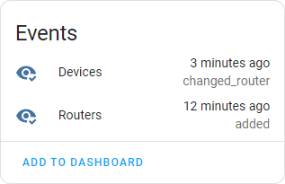
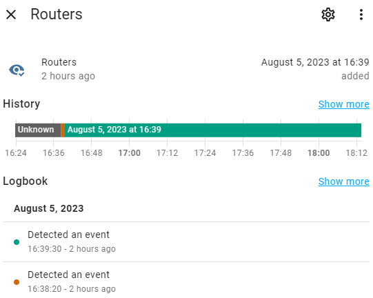
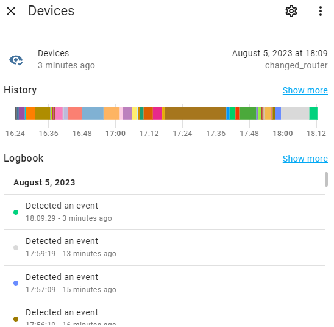

# Events

Each event has a system type and its own subtype passed in the event data.

Also, each event data contains the serial number of the primary router (`primary_router`), so that it is possible to distinguish between events received from different hubs within the `huawei_mesh_router` integration.

## Common events

Common events taking place on the mesh network. Have the event type `huawei_mesh_router_event`.

### The dependent router has connected to the mesh network

Occurs when a new dependent (satellite) router is connected to the mesh network.

Event subtype: `added`

Example:

```yaml
event_type: huawei_mesh_router_event
data:
  type: added
  primary_router: SJPEQ00000000000
  router:
    ip: 192.168.3.2
    mac: AB:CD:EF:01:23:45
    name: Livingroom router
origin: LOCAL
time_fired: "2023-08-05T00:00:00+00:00"
context:
  id: 01H72VBGBYGM1TTBA1W8142GAZ
  parent_id: null
  user_id: null
```

### The dependent router disconnected from the mesh network

Occurs when a new dependent (satellite) router is disconnected from the mesh network.

Event subtype: `removed`

Example:

```yaml
event_type: huawei_mesh_router_event
data:
  type: removed
  primary_router: SJPEQ00000000000
  router:
    ip: 192.168.3.2
    mac: AB:CD:EF:01:23:45
    name: Livingroom router
origin: LOCAL
time_fired: "2023-08-05T00:00:00+00:00"
context:
  id: 01H72V9C2K2D21XSSECTEW83MZ
  parent_id: null
  user_id: null
```

## Device events

Events related to connecting, disconnecting, or moving devices inside a mesh network. Have the event type `huawei_mesh_router_device_event`.

Each event contain both information about the device itself and information about the router to which the device has connected (or disconnected from).

### The device has connected to the mesh network

Occurs when the device is connected to the mesh network.

Event subtype: `connected`

Example:

```yaml
event_type: huawei_mesh_router_device_event
data:
  type: connected
  primary_router: SJPEQ00000000000
  device:
    ip: 192.168.3.4
    mac: 11:22:33:44:55:66
    name: V. Makeev - Lenovo
  router:
    id: primary
    name: Primary router
origin: LOCAL
time_fired: "2023-08-05T00:00:00+00:00"
context:
  id: 01H72TP1ZDER1NQJZPN7Q3PDQR
  parent_id: null
  user_id: null
```

### The device disconnected from the mesh network

Occurs when the device is disconnected from the mesh network.

Event subtype: `disconnected`

Example:

```yaml
event_type: huawei_mesh_router_device_event
data:
  type: disconnected
  primary_router: SJPEQ00000000000
  device:
    ip: 192.168.3.4
    mac: 11:22:33:44:55:66
    name: V. Makeev - Samsung Galaxy S21
  router:
    id: AB:CD:EF:01:23:45
    name: Livingroom router
origin: LOCAL
time_fired: "2023-08-05T00:00:00+00:00"
context:
  id: 01H72V82ZQ4HCSAHEE785PVQ6P
  parent_id: null
  user_id: null
```

### The device has changed the router within the mesh network

Occurs when a device connects to another router within a mesh network.

Event subtype: `changed_router`

Example:

```yaml
event_type: huawei_mesh_router_device_event
data:
  type: changed_router
  primary_router: SJPEQ00000000000
  device:
    ip: 192.168.3.4
    mac: 11:22:33:44:55:66
    name: V. Makeev - Lenovo
  router_from:
    id: AB:CD:EF:01:23:45
    name: Livingroom router
  router_to:
    id: primary
    name: Primary router
origin: LOCAL
time_fired: "2023-08-05T00:00:00+00:00"
context:
  id: 01H72V7AJ6EVCX77RQG2DQYDWB
  parent_id: null
  user_id: null
```

# Event entities

The integration also supports displaying events as entities. 

Primary router have the following event entities:
* `event.<integration_name>_routers`
* `event.<integration_name>_devices`



## Routers

Displays events of type `huawei_mesh_router_event` with subtypes `added` and `removed`

Entity id is `event.<integration_name>_routers`



## Devices

Displays events of type `huawei_mesh_router_device_event` with subtypes `connected`, `disconnected` and `changed_router`. 

Entity id is `event.<integration_name>_devices`

