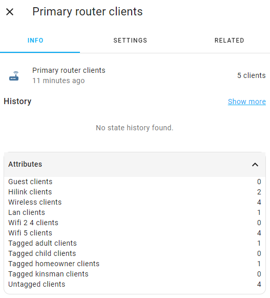
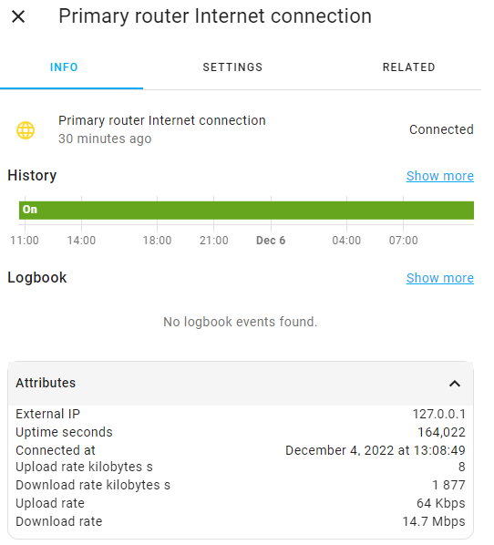

# Sensors

The component creates a separate device for each router connected to the mesh network. 

Each device has its own set of sensors. 

The primary router has more sensors than the additional ones.

**Primary router sensors:**

**Additional router sensors:**

## Number of connected devices

The component provides the ability to obtain the number of connected devices both to the entire mesh network and to specific routers using sensors.

There are two sensors that are always present:
* `sensor.<integration_name>_clients_primary_router` - number of devices connected to the primary router
* `sensor.<integration_name>_total_clients_primary_router` - total number of devices connected to the mesh network

Also, one sensor is created for each additional router in the mesh network:
* `sensor.<integration_name>_clients_<router_name>`

_Note: Sensors for additional routers are located in their own devices._

Each sensor exposes the following attributes:

|         Attribute            |                                        Description                                         |
|------------------------------|--------------------------------------------------------------------------------------------|
| `guest_clients`              | Number of devices connected to the guest network                                           |
| `hilink_clients`             | Number of devices connected via HiLink                                                     |
| `wireless_clients`           | Number of devices connected wirelessly                                                     |
| `lan_clients`                | Number of devices connected by cable                                                       |
| `wifi_2_4_clients`           | Number of devices connected to Wi-Fi 2.4 GHz                                               |
| `wifi_5_clients`             | Number of devices connected to Wi-Fi 5 GHz                                                 |
| `tagged_<tag_name>_clients`  | Number of connected devices with a specific [tag](device-tags.md#device-tags) `<tag_name>` |
| `untagged_clients`           | Number of connected devices without any [tags](device-tags.md#device-tags)                 |

## Uptime

The component allows you to get the uptime of each router in your mesh network. 
The sensor value is the date and time when the router was last turned on.

There is one sensor that is always present:
* `sensor.<integration_name>_uptime_primary_router`

Also, one sensor is created for each additional router in the mesh network:
* `sensor.<integration_name>_uptime_<router_name>`

_Note: Sensors for additional routers are located in their own devices. The sensor value may not be entirely accurate if the clocks on the router and on the Home Assistant server are out of sync._

Each sensor exposes the following attributes:

|     Attribute        |          Description            |
|----------------------|---------------------------------|
| `seconds`            | Uptime of the router in seconds |

## Internet connection

The component is able to track information about the connection of the router to the Internet.
The sensor is in the "on" state if the Internet connection is established.

There is one sensor that is always present:
* `binary_sensor.<integration_name>_internet_connection_primary_router`

_Note: Sensors for additional routers are located in their own devices._

Each sensor exposes the following attributes:

|     Attribute        |                        Description                          |
|----------------------|-------------------------------------------------------------|
| `external_ip`        | WAN IP address                                              |
| `uptime_seconds`     | Connection uptime in seconds                                |
| `connected_at`       | The date and time when the connection was last established  |

_Note: The `connected_at` attribute value may not be entirely accurate if the clocks on the router and on the Home Assistant server are out of sync._