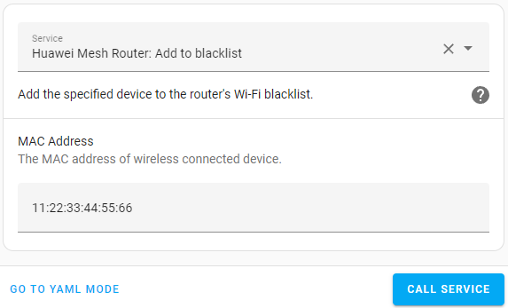
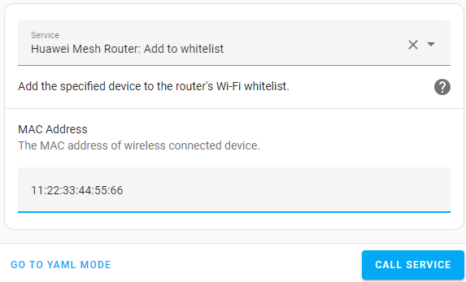
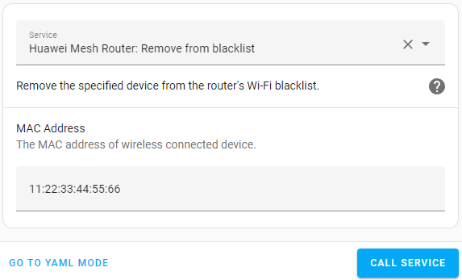
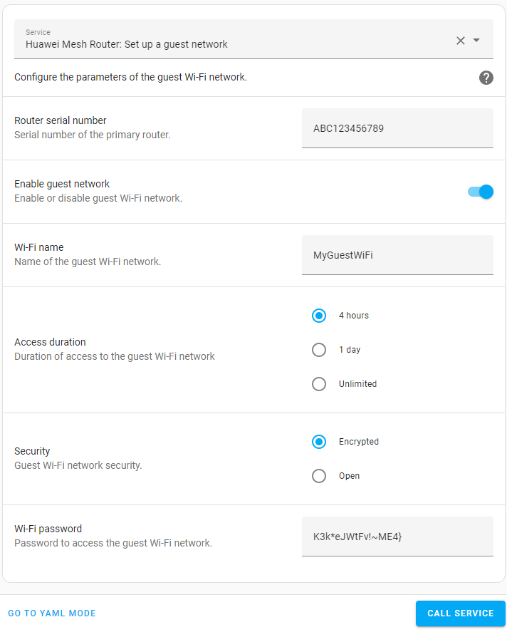
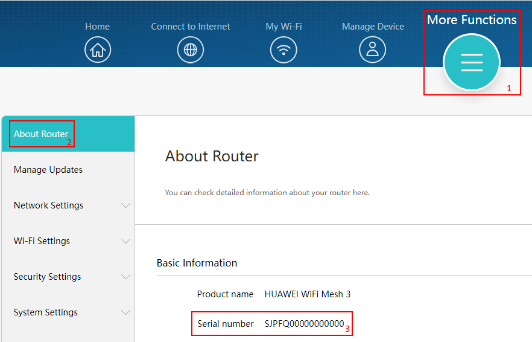

# Services

The component provides access to some services that can be used in your automations or other use cases.

## Access lists

See also: [access control mode](controls.md#wi-fi-access-control-mode)

### Add device to the blacklist

Service name: `huawei_mesh_router.blacklist_add`

Example:
```
service: huawei_mesh_router.blacklist_add
data:
  mac_address: "11:22:33:44:55:66"
```



Adds a device with the specified MAC address to the blacklist. If the device is on the whitelist, it will automatically be removed from it.

### Add device to the whitelist

Service name: `huawei_mesh_router.whitelist_add`

Example:
```
service: huawei_mesh_router.whitelist_add
data:
  mac_address: "11:22:33:44:55:66"
```



Adds a device with the specified MAC address to the whitelist. If the device is on the blacklist, it will automatically be removed from it.

### Remove device from the blacklist

Service name: `huawei_mesh_router.blacklist_remove`

Example:
```
service: huawei_mesh_router.blacklist_remove
data:
  mac_address: "11:22:33:44:55:66"
```



Removes a device with the specified MAC address from the blacklist.

### Remove device from the whitelist

Service name: `huawei_mesh_router.whitelist_remove`

Example:
```
service: huawei_mesh_router.whitelist_remove
data:
  mac_address: "11:22:33:44:55:66"
```


Removes a device with the specified MAC address from the whitelist.

### Set up a guest network

Service name: `huawei_mesh_router.guest_network_setup`

Example:
```
service: huawei_mesh_router.guest_network_setup
data:
  serial_number: ABC123456789
  enabled: true
  ssid: MyGuestWiFi
  duration: 4 hours
  security: Encrypted
  password: K3k*eJWtFv!~ME4}

```



Configures the parameters of the guest Wi-Fi network.

The serial number of the router can be found in the web interface at this address: `http://<your-router-address>/html/index.html#/more/deviceinfo`

