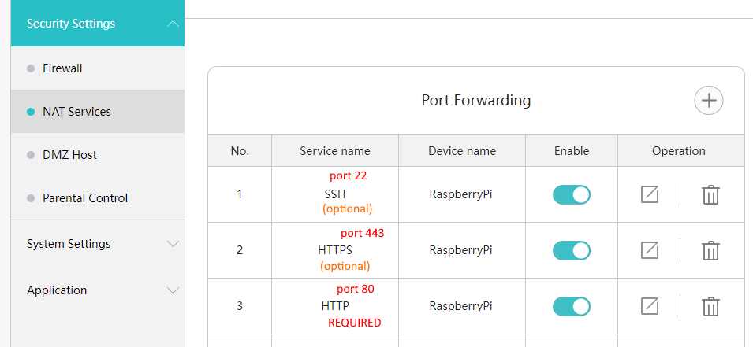
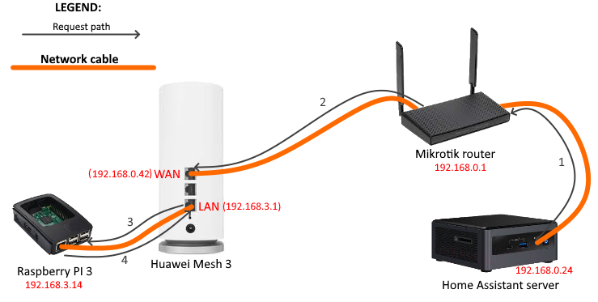

# Connecting via another router

If your Home Assistant server is not connected directly to the primary Huawei router, then you may encounter limitations in the functioning of the component.

This is due to the fact that Huawei routers allow connection to their API only from their internal (LAN) network.

Unfortunately, this is a fundamental limitation on the part of the router, but there are ways to get around it.

## Way 1

Connect your Home Assistant server directly to the internal network of your Huawei router. After that, the component will be able to access the router API, and it will function in full.

## Way 2

If for some reason you cannot or do not want to connect the Home Assistant server to the internal network of the Huawei router, you will need to configure the reverse proxy server on some other device connected to its internal network.

As an example, consider a connection scheme in which there is a Raspberry PI in the router's internal network, with HAProxy installed (but you can use anything else).

The port forwarding is configured on the router itself so that requests from the "WAN" (in fact, from the Mikrotik router and other devices, including the smart home server) are redirected to the Raspberry Pi.



HAProxy on Raspberry Pi redirects incoming requests to it back to the Huawei router, but this time the router already believes that these requests are coming from a trusted LAN network, and allows access to the API.

When setting up integration, you need to specify the address of the Huawei router from the point of view of the network in which the Home Assistant server itself is located.

### Example

My smart home server is connected to a Mikrotik router that provides access to the Internet.

The address of the Mikrotik router is `192.168.0.1`. The address of my smart home server is `192.168.0.24`. The Huawei router is also connected to the Mikrotik router, and only distributes Wi-Fi inside the house.

Huawei router has a LAN address of `192.168.3.1`, but in the network to which the Home Assistant server is connected (via Mikrotik), its WAN address is `192.168.0.42`.

In the component configuration, I will have to specify exactly `192.168.0.42`.

Visually, the connection diagram looks like this: 




Part of the HAProxy configuration: 

```
frontend http-80
  mode http
  bind *:80

  acl IsMeshRouter hdr_reg(host) ^mesh\.router\.home$  # Home DNS name (optional)
  acl IsMeshRouter hdr_reg(host) ^192\.168\.0\.42$     # WAN router address (required)
  acl IsMeshRouter hdr_reg(host) ^192\.168\.3\.1$      # LAN router address (optional)
  
  use_backend Mesh if IsMeshRouter


backend Mesh
  mode http
  balance leastconn
  http-request set-header Host 192.168.3.1 # Strongly required!
  server router 192.168.3.1:80
```


Yes, this interaction scheme looks somewhat cumbersome, but, unfortunately, the configuration capabilities of Huawei routers are very limited. An alternative option would be to connect the smart home server directly to the Huawei router (to its internal LAN network).
